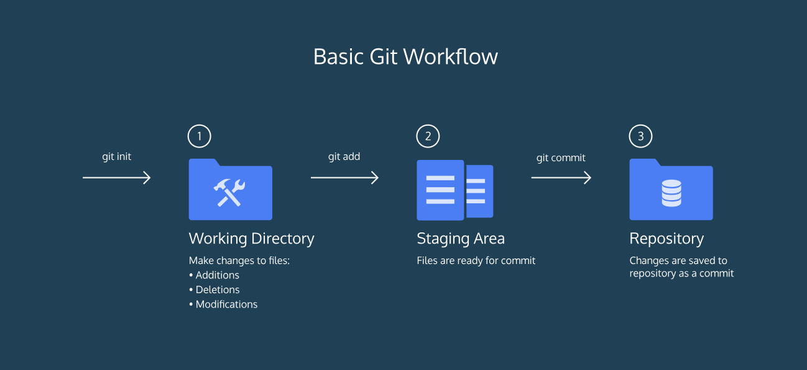

# <p align="center"> Git Cheat Sheet
  <p align="center"> A personal cheat sheet that covers basic Git commands and information for reference.

## Helpful Resources/Related Links:
* [Codeacademy's Learn Git Course](https://www.codecademy.com/learn/learn-git)
* [ProGit eBook](https://git-scm.com/book/en/v2)
* [Atlassian's Tutorial on Git](https://www.atlassian.com/git/tutorials)
* [Interesting blog post that explains Git/Github in plain english](https://blog.red-badger.com/blog/2016/11/29/gitgithub-in-plain-english)
* [Interesting blog post on how to write a git commit message](https://chris.beams.io/posts/git-commit/)
* [Similar Git Cheatsheet](https://services.github.com/on-demand/downloads/github-git-cheat-sheet.pdf)
> The directory *C:\Program Files\Git\mingw64\share\doc\git-doc* holds interesting documentation for all of the popular commands.

## <p align="center"> Basic Git Commands


### How to display help information about Git
` $ git help `


### How to sign in/set Github Account in Git Bash console:
```
$ git config --global user.name "John Doe"
$ git config --global user.email "johndoe@example.com" 
```


### How to sign out/unset Github Account in Git Bash console:
```
$ git config --global --unset user.name
$ git config --global --unset user.email
```


### How to confirm that user.name & user.email keys either have values or are empty from configuration settings: 
* ` $ git config --list ` OR 
* ` $ git config -l `     OR
* ` $ git config user.name ` AND ` $ git config user.email `


### How to (re)initialize an empty Git repository:
` $ git init `

```diff
- NOTE: This command creates a hidden folder named `.git` in your working directory.
```


### How to completely delete a git repository:
` $ rm -rf .git `

```diff
- NOTE: As an alternative, you can just manually delete the folder `.git` from the file directory.
```




A Git project can be thought of as having three parts:

> 1. A Working Directory: where you'll be doing all the work: creating, editing, deleting and organizing files
> 2. A Staging Area: where you'll list changes you make to the working directory
> 3. A Repository: where Git permanently stores those changes as different versions of the project

The Git workflow consists of:
> * editing files in the working directory
> * adding files to the staging area
> * saving/commiting changes to a Git repository. 


### How to adds all of the files from the working directory to the staging area
` $ git add . `


### How to inspect the contents of the working directory and staging area
` $ git status `


### How to show the difference between the working directory and the staging area
` $ git diff `


### How to permanently store the file changes from the staging area in the repository
` $ git commit -m "message" `


### …or push an existing Git repository from the command line to a Github repo
> Run this command initially if you're pushing to a new Github repo 
> ` $ git remote add origin https://github.com/Razat94/gold.git `

` $ git push -u origin master `


### How to show a log of all previous commits:
` $ git log `

```diff
- NOTE: 
In the output, notice:

* A 40-character code, called a SHA, that uniquely identifies the commit.
* The commit author
* The date and time of the commit
* The commit message
```

> After running this command, if you're stuck on the page, you may need to press 'q' on your keyboard to restore the terminal.